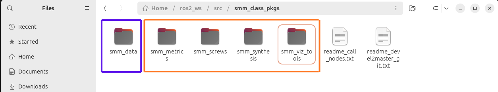
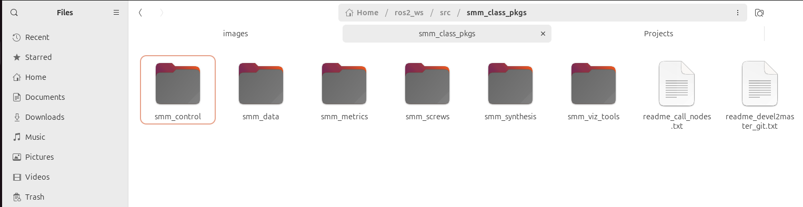
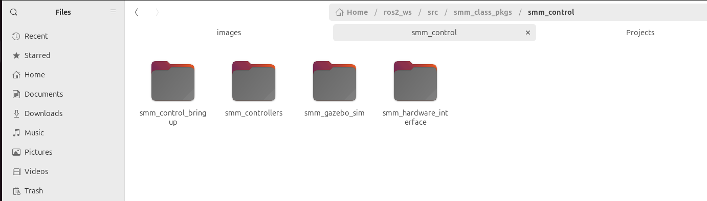

# Serial Metamorphic Manipulator ROS2


A modular ROS 2 software framework for the subclass of Serial Metamorphic Manipulators. Here all info for using each repo are presented. This is your start-point for SMMs!!!

## Overview

This project provides a modular **ROS 2 software framework** for the modeling, synthesis, evaluation, and visualization of **Serial Metamorphic Manipulators (SMMs)**.

**This is NOT a ROS package!** It provides info on all ros_pkgs developed for SMMs. The design framework implemented for SMMs is briefly discussed and the role of each ros_pkg is presented!

The framework is designed to support the full pipeline of SMM development, from structure generation to performance analysis, using a combination of screw-theoretic modeling, automated configuration, and ROS-integrated tools.

At its core, the system is built around the `smm_screws` package, which implements the fundamental mathematical and computational infrastructure. This includes:

- screw-theoretic representations of robotic systems  
- analytical kinematics and dynamics formulations  
- a YAML-based robot description loader for automatic structure configuration  
- a robot context abstraction that links structural definitions with computational modules  

On top of this core layer, additional packages extend the framework’s capabilities:

- `smm_synthesis` enables the generation of SMM robot structures based on predefined rules and user-defined YAML parameters  
- `smm_metrics` provides performance evaluation tools for analyzing robot characteristics such as manipulability and workspace properties  
- `smm_viz_tools` offers visualization utilities, primarily through RViz, for inspecting robot configurations and computed metrics  

The framework follows a **generated-data driven workflow**, where robot structures and intermediate results are stored in YAML format. These runtime-generated files are organized in a user-defined `smm_data` directory, which acts as a shared data layer between nodes and packages.

To be updated...

## Software stack structure

The framework is organized as a set of modular ROS 2 repositories, each covering a distinct part of the SMM software stack.

### Main hub (modelling, evaluation, visualization)

- [`smm_screws`](https://github.com/StravopodisNikos/smm_screws)  
  Core screw-theory package providing robot representations, YAML-based loading utilities, robot context abstractions, and analytical kinematics/dynamics tools.

- [`smm_synthesis`](https://github.com/StravopodisNikos/smm_synthesis)  
  Structure synthesis and robot generation package for creating valid SMM configurations based on predefined rules and user-defined YAML inputs.

- [`smm_viz_tools`](https://github.com/StravopodisNikos/smm_viz_tools)  
  Visualization package for RViz-based inspection of robot structures, frames, and computed results.  
  
- [`smm_metrics`](https://github.com/StravopodisNikos/smm_metrics) 
  Performance evaluation package containing metrics for robot analysis and comparison.  

### Control hub (simulation, controllers, hardware)

- [`smm_gazebo_sim`](https://github.com/StravopodisNikos/smm_gazebo_sim) 
  Gazebo simulation tools. Robot spawn, ROS default controllers.

## Package Roles

The repositories are designed to work together as a modular framework:

- `smm_screws` provides the core mathematical and computational backbone.
- `smm_synthesis` generates robot structures and runtime model data.
- `smm_viz_tools` visual tools
- `smm_metrics` evaluates generated robots using performance measures.
- `smm_gazebo_sim` provides tools for gazebo simulation-works along `smm_synthesis`.

## Key Dependencies

The framework relies on the following main dependencies for ROS 2 integration, robot modeling, numerical computation, and visualization.

### ROS 2 Packages
- `rclcpp` — Core ROS 2 C++ client library
- `sensor_msgs` — Joint-state transport and standard robot state messaging
- `geometry_msgs` — Pose, twist, and vector message types
- `visualization_msgs` — RViz marker and marker array visualization
- `std_msgs` — Standard ROS 2 message primitives
- `ament_cmake` — ROS 2 CMake build system support
- `ament_cmake_python` — Python node install support where needed
- `launch` — ROS 2 launch system
- `launch_ros` — ROS 2 node launching utilities
- `ament_index_python` — Package-share directory lookup in Python launch files

### Robot Description / Kinematics / Dynamics
- `urdf` — Robot model description
- `xacro` — Parametric robot description generation
- `robot_state_publisher` — TF publishing from URDF
- `joint_state_publisher` / custom joint GUI pipelines — Joint-state driven visualization
- `tf2` / `tf2_ros` — Transform handling where required by the ROS 2 pipeline
- `kdl_parser` — URDF-to-KDL conversion for extractor/debug utilities
- `orocos_kdl` — KDL-based forward-kinematics and frame extraction utilities

### C++ / Numerical Libraries
- `Eigen3` — Core linear algebra, transformations, SVD, eigensolvers, and matrix operations
- `yaml-cpp` — YAML parsing for synthesized robot data, twists, transforms, inertias, and assembly parameters
- Standard C++ library — memory management, containers, exceptions, streams, algorithms, and numeric utilities

### Visualization / GUI
- `rviz2` — 3D visualization environment
- `visualization_msgs` — Ellipsoids, axes, TCP arrows, and debug markers
- Custom Python GUI node (`smm_joint_motion_gui_ndof_node.py`) — interactive input of `q`, `dq`, `ddq`

### Custom Package-Level Interfaces
- `smm_screws` — Core screw-theory kinematics and dynamics library
- `smm_metrics` — Manipulability and other analytical metrics
- `smm_viz_tools` — Visualization and debug utilities
- `smm_synthesis` — Synthesis pipeline, YAML generation, and integration launch files

### Simulation

- Under development!

### Typical System Dependencies
On Ubuntu/ROS 2 systems, the following are typically required through apt:

- `libeigen3-dev`
- `libyaml-cpp-dev`
- ROS 2 packages for:
  - `rclcpp`
  - `sensor-msgs`
  - `geometry-msgs`
  - `visualization-msgs`
  - `robot-state-publisher`
  - `xacro`
  - `joint-state-publisher`
  - `rviz2`
  - `kdl-parser`
  - `orocos-kdl`

## Installation and Build

To start using the framework do:

```text
mkdir -p ~/ros2_ws/src/smm_class_pkgs
cd ~/ros2_ws/src/smm_class_pkgs

mkdir ./smm_data

git clone https://github.com/StravopodisNikos/smm_screws.git
git clone https://github.com/StravopodisNikos/smm_synthesis.git
git clone https://github.com/StravopodisNikos/smm_metrics.git
git clone https://github.com/StravopodisNikos/smm_viz_tools.git
```

To build:
```text
cd ~/ros2_ws/
colcon build --packages-select smm_screws smm_viz_tools smm_synthesis smm_metrics
source install/setup.bash
```
## Workspace Setup

The local folder should look something like this (no control):



The local folder should look something like this (with control hub stack):




## Current Status

- Finished core upgrade to ROS2.
- On progress: control and gazebo integration.
- Need to give examples for non-ros library usage.

## License

This project is licensed under the BSD 3-Clause License.
